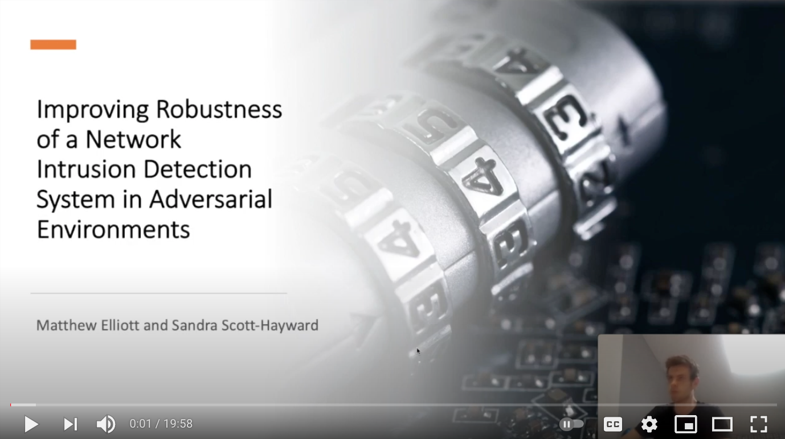

# Hydra2 Testing Adversarial Defences of NIDS in SDN

This repository contains the code for Hydra2, which encapsulates  Neptune, a machine learning based network intrusion detection system (NIDS) for Software-Defined Networks (SDN).

```
Matthew Elliott and Sandra Scott-Hayward
"Improving Robustness of a Network Intrusion Detection System in Adversarial Environments"
```

**For details on background literature, architecture, results, analysis and conclusions,  
please see [`finished_work/Hydra2.pdf`](./finished_work/Hydra2.pdf).**

## Introduction
As society and technology develop, more and more of our time is spent online, from shopping to socialising, working to banking. Ensuring our safety from malicious actors trying to capitalise on this digitisation is becoming ever more important. One such system that was developed to defend against attacks is a Network Intrusion Detection System (NIDS), a common tool used to detect intrusion attempts. Early adaptions used pre-configured signature detection to recognise attacks. Those early models evolved to use machine learning based anomaly detection to monitor real-time network activity and autonomously recognise intrusion attempts. Worryingly, the relatively new field of adversarial machine learning has been shown to be extremely effective in creating adversarial attacks that can easily bypass the NIDS. Adversary-aware feature selection, adversarial training and ensemble method were all used to increase the adversarial attack detection rate of the ML classifiers in the NIDS. Adversary-aware feature selection was the most effective, increasing the accuracy of three of the four classifiers from 0 for some adversarial attacks, to 0.98 for all adversarial attacks. In this work we build Hydra2, a tool to let users prototype an attack in a sand-box environment that has the ability of detecting adversarial attacks. The users can then quantify the results by adversarially attacking their prototype NIDS.

## Presentation of Usage and Results
[](https://youtu.be/vhyMVcHPIbI)

<iframe width="560" height="315" src="https://www.youtube.com/embed/vhyMVcHPIbI" title="YouTube video player" frameborder="0" allow="accelerometer; autoplay; clipboard-write; encrypted-media; gyroscope; picture-in-picture" allowfullscreen></iframe>
## Getting Started

Hydra 2 is designed to run on Ubuntu 18.04
 ```
cd; git clone git@gitlab.eeecs.qub.ac.uk:40153557/NIDS_Masters_Project.git
sudo mkdir /opt/adversarialtestingsdn
sudo mv NIDS_Masters_Project/* /opt/adversarialtestingsdn
cd /opt/adversarialtestingsdn
sudo ./setup.sh
```
If there is a problem with the `setup.sh` script, run the commands individually. You should be able to diagnose any
personal problems from there.


## Architecture
<p align="middle">
 
</p>


## Running Hydra2
As the user, you will need to preform the following steps in this order:
1) Configure Neptune
2) Adversarially attack Neptune via the TestManager

### NIDS config attributes explained
`attack_feature_selection`: The attack that either the feature selection or adversarial training will be modeled on.  
`feature_selection_type`: The type of features that should be considered by Neptune.  
`preprocessing`: The pre-processing that the data is subjected to.  
`classifiers`: An array of machine learning models.  
`weights`: The relative influence each classifier has in the ensemble.  
`adversarial_training_types`: The adverasrial attack that is used for adversarilly training the models.  
`ensemble_vote_type`: How the ensemble predicts the output from the predictions of the individual classifiers.  

**For the individual exact specification and effects all the following attributes have on the performance of Neptune,
please see [`finished_work/Hydra2.pdf`](./finished_work/Hydra2.pdf) paper in this project root dir.**

### Hydra2 Attack and Neptune Configuration Options  

Available `attack_feature_selection` / attack to pass to `python3 App/TestManager/main.py <attack>`
* Evasion: Rate
* Evasion: Payload
* Evasion: Pairflow
* Evasion: Rate+Payload
* Evasion: Payload+Pairflow
* Evasion: Rate+Pairflow
* Evasion: Payload+Rate+Pairflow

Available `feature_selection_type`
* all
* perturbed
* non-perturbed
* all-non-perturbed

Available `preprocessing` inputs
* none
* [robust](https://scikit-learn.org/stable/modules/generated/sklearn.preprocessing.RobustScaler.html)
* [standardise](https://scikit-learn.org/stable/modules/generated/sklearn.preprocessing.StandardScaler.html)
* [normalise](https://scikit-learn.org/stable/modules/generated/sklearn.preprocessing.normalize.html)

Available `classifiers`
* [RF](https://scikit-learn.org/stable/modules/generated/sklearn.ensemble.RandomForestClassifier.html)
* [KNN](https://scikit-learn.org/stable/modules/generated/sklearn.neighbors.KNeighborsClassifier.html)
* [SVM](https://scikit-learn.org/stable/modules/generated/sklearn.svm.SVC.html)
* [LR](https://scikit-learn.org/stable/modules/generated/sklearn.linear_model.LogisticRegression.html)

Available `adversarial_training_types`
* [FGSM](https://adversarial-robustness-toolbox.readthedocs.io/en/stable/modules/attacks/evasion.html#fast-gradient-method-fgm)
* [BIM](https://adversarial-robustness-toolbox.readthedocs.io/en/stable/modules/attacks/evasion.html#basic-iterative-method-bim)
* [PGD](https://adversarial-robustness-toolbox.readthedocs.io/en/stable/modules/attacks/evasion.html#projected-gradient-descent-pgd)
* [HSJ](https://adversarial-robustness-toolbox.readthedocs.io/en/stable/modules/attacks/evasion.html#hopskipjump-attack)

*Note: the adversarial methods FGSM, BIM abd PGD require classifiers with loss gradients. The classifiers with loss
 gradients are SVM and LR only. HSJ is compatible with all classifiers.*

Available `ensemble_vote_type`
* hard
* soft  

*Note: the hard voting type will act as a basic voting type where each classifier votes on the label(s) of the data. The
soft voting type decides the majority by summing the probability of each label for each classifier and picks the label
with the highest probability*

### Example workflow

#### Step 1
With a text editor of your choice, open `App/nids_config/config.json`. We will use the editor vim as an example:
 ```
vim App/nids_config/config.json
```

#### Step 2
Enter in your desired configuration for neptune. Here is an example:
 ```
{
  "attack_feature_selection": "Evasion: Pairflow",
  "feature_selection_type": "all",
  "preprocessing": "robust",
  "classifiers": ["LR", "SVM],
  "weights": [1, 2],
  "adversarial_training_types": ["none" ,"FGSM"],
  "ensemble_vote_type": "hard"
}
```
In this example, Neptune will:
* select all available features
* pre-process the data via Robust Scaling
* adversairlly train the SVM model via the Fast Gradient Sign Method, perturbing features that would normally be
perturbed in an *Evasion: Pairflow* attack.
* Join the LR and SVM classifiers of respective weights 1 and 2 into a hard-voting ensemble

#### Step 3
Run the test with your choice of adversarial attack. For example, the *Evasion: Pairflow* adversarial attack.  

(Note: the quotation marks are important so that the attack gets passed as a single argument)  
 ```
sudo python3 App/TestManager/main.py "Evasion: Pairflow"
```


### Validating Neptune Configuration
The TestManager will do this for you. If there is a mistake, It will be identified and help will be given as to
what the proper configuration should be.


## Generating your own Flow Statistics to train Neptune
This repository only comes with a small selection of sample flow statistics in App/stats_training and App/stats_testing (as well as in App/tests/test_stats/).  The details of the training datasets we used are provided in the paper. Unfortunately, we cannot make these available as the DARPA dataset is restricted access. To generate your own flow statistics for Neptune to use in training and testing, you can use [App/Neptune/traffic_stats.py](https://github.com/sdshayward/AdversarialSDN-Hydra/blob/master/App/Neptune/traffic_stats.py).  This class is the flow statistic generation class used by Neptune itself. However, it can also be used standalone to generate your own statistics.

As mentioned in the Installation instructions, Argus is required for flow statistic generation.  Mininet and Faucet will need to be started up manually as Argus will listen to s1-eth0 by default. However, this can be [changed](https://github.com/sdshayward/AdversarialSDN-Hydra/blob/4cbb585eef9856b290bb5eb09cdbd6b450811e11/App/traffic_stats.py#L89) based on your personal setup.  The python script for Hydra launches Mininet [like so](https://github.com/sdshayward/AdversarialSDN-Hydra/blob/f4de6cd9197c2eff6417f2b43d0a20e929bbeeef/App/TestManager/main.py#L185). An equivalent can be launched manually via the command line.

```
sudo mn --topo single,10 --controller remote,ip=127.0.0.1,port=6653
```
Note that the SDN controller is set to remote on port 6653, which is where Faucet should be running.

The Class can be started by executing:
```
sudo python traffic_stats.py
```
When recording your benign traffic, set [self.malicious = 0](https://github.com/sdshayward/AdversarialSDN-Hydra/blob/4cbb585eef9856b290bb5eb09cdbd6b450811e11/App/traffic_stats.py#L57)

When recording malicious traffic set [self.malicious = 1](https://github.com/sdshayward/AdversarialSDN-Hydra/blob/4cbb585eef9856b290bb5eb09cdbd6b450811e11/App/traffic_stats.py#L57)

(This labels your flows so that the ML models can use them (supervised learning).)


## Built With

* [Faucet](https://faucet.nz/) - SDN Controller


## Contributors

* **Matthew Elliott**
* **Sandra Scott-Hayward**

To get in contact about the project, please email Matthew at melliott21@qub.ac.uk

## Acknowledgments
* Hydra 2 was built on the [original Hydra by James Aiken and Sandra Scott-Hayward](https://github.com/sdshayward/AdversarialSDN-Hydra).
* For more details of Hydra, please visit [IEEE NFV-SDN 2019 article](https://pureadmin.qub.ac.uk/ws/portalfiles/portal/192742980/1570562331_Hydra.pdf)
